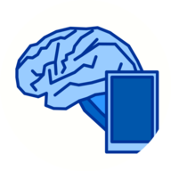

# brain - Simply GTD®

brain is a web-based todo app for implementing David Allen's 
Getting Things Done® methodology. It supports assigning tasks 
with contexts, projects and tags, as well as start and due 
date, in order to provide you with the tools to keep on top
of your tasks at all time.

The core David Allen's GTD method is to keep all your ideas
and tasks in one safe system so you don't have to think about
them until you either go through them to plan further or actually
do something about them. After having ordered and planned 
everything, GTD is supposed to let you know at any time, what
your next action can be. (*Note:* This is a very, very short
and probably equally wrong description of the GTD principles.
If you want to know more about it, [Wikipedia](https://en.wikipedia.org/wiki/Getting_Things_Done)
might be a better place to start.)

Read the [docs](docs/index.md) for details on how to set up
and use brain.

***NOTE:*** Even though brain is a PWA, which is supposed to
sync between multiple devices at some point, it currently only
uses local storage in the browser (specifically the IndexDB).
The synchronization server is currently not implemented. If
you need multiple-device synchronization, either wait until it's
done or [contribute.](docs/contributing.md).

***Note: (another one)*** brain is in no way endorsed by or related
to David Allen or his company.